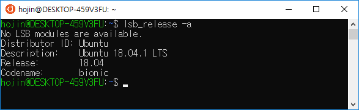
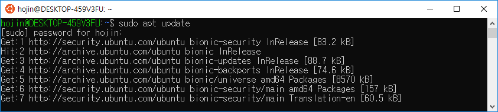
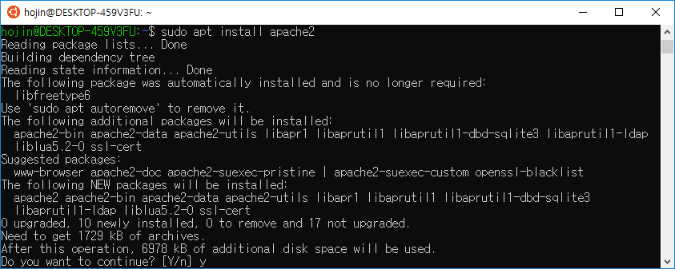
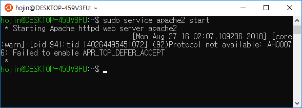
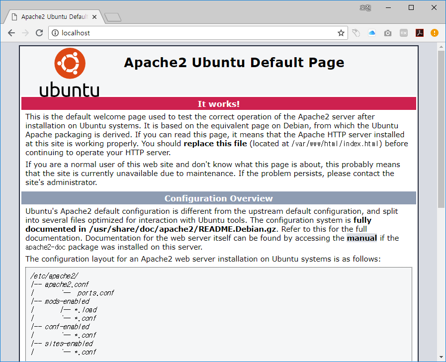
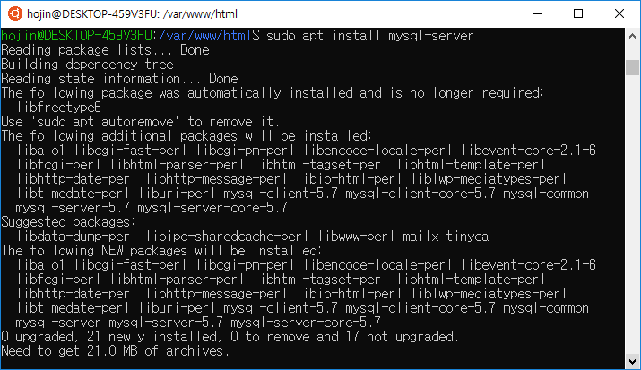
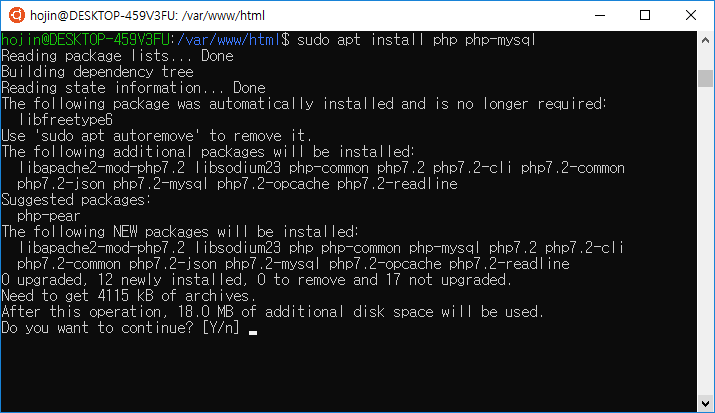
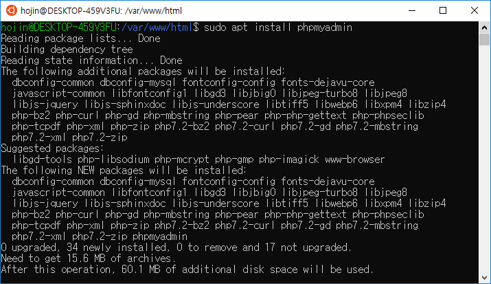
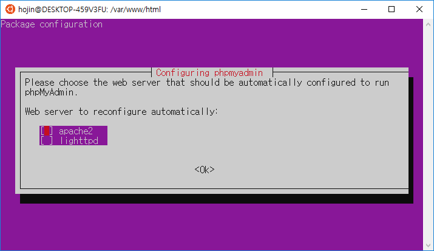
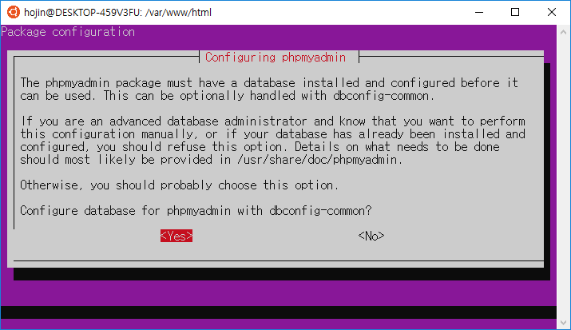

# LAMP 설치하기

윈도우 WSL에서 LAMP를 설치하는 방법입니다.

LAMP는 Linux, Apache, Mysql, PHP 의 약자 입니다.


## 우분투 버전

리눅스 버전을 확인합니다.

```
hojin@DESKTOP-459V3FU:~$ lsb_release -a
No LSB modules are available.
Distributor ID: Ubuntu
Description:    Ubuntu 18.04.1 LTS
Release:        18.04
Codename:       bionic
```




## 패키지 업그레이드

우분투 리눅스 패키지를 설치하기 위해서 최신의 상태로 갱신을 해 주는 것이 좋습니다.

``` 
sudo apt update && sudo apt upgrade
```

업데이트를 하기위해서는 root관리자 모드로 실행을 해야 합니다. 명령어 앞에 `sudo`명령을 같이 사용하게 되면  root관리자 모드로 실행을 할 수 있습니다.




## 아파치2 웹서버 설치

웹서버를 설치합니다. 아파치2 를 우분투 패키지에서 다운로드 받아 자동을 설치할 수 있습니다.

 ```
sudo apt install apache2
 ```




아파치를 실행합니다.

```
sudo service apache2 start
```




브라우저로 `localhost`를 접속해 보도록 합니다.



정상적으로 웹서버가 동작을 하는 것을 확인해 볼 수 있습니다.

문서의 디폴트 페이지는 `/var/www/html`의 내용이 출력이 됩니다. 위의 내용은 `/etc/apache2/apache2.conf`에서 수정이 가능합니다.


## Mysql 설치

MySQL은 RDBMS의 데이터베이스 입니다. PHP에서는 가장 많이 사용을 하고 있는 무료 데이터베이스 시스템 입니다.


```
sudo apt install mysql-server
```





자동으로 페키지를 다운로드 받아 설치를 합니다.


## PHP 설치

아파치와 MySQL 서버를 설치하였다면 마지막으로 PHP를 설치를 하도록 합니다.

```
sudo apt install php php-mysql
```

php와 php-mysql 패키지 2개를 설치를 합니다.




## phpMyAdmin

phpMyAdmin은 PHP로 제작된 MySQL 데이터 베이스 관리툴 입니다.

```
sudo apt install phpmyadmin
```





phpmyadmin 은 웹기반의 관리툴 입니다. 자동으로 실행되는 웹서버를 선택하도록 합니다.



설정 데이터베이스 적용를 `예`를 선택합니다.




루트 암호를 입력합니다.


