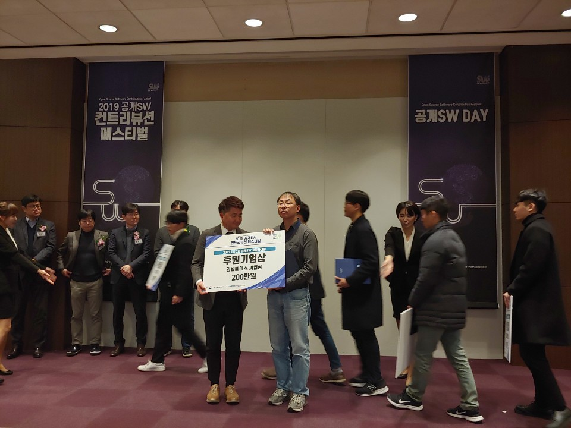
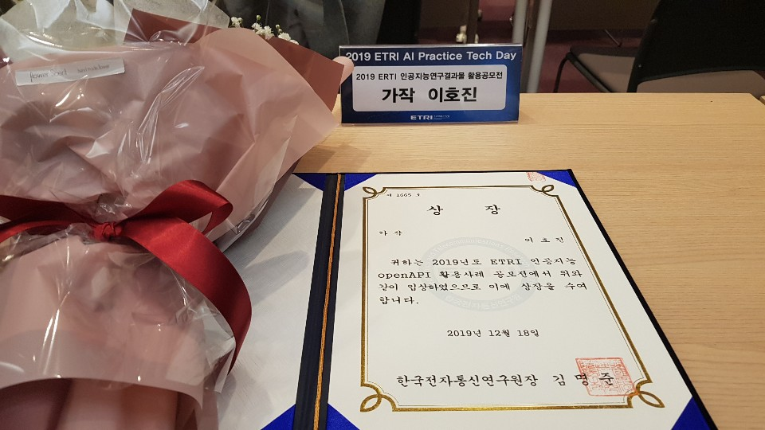
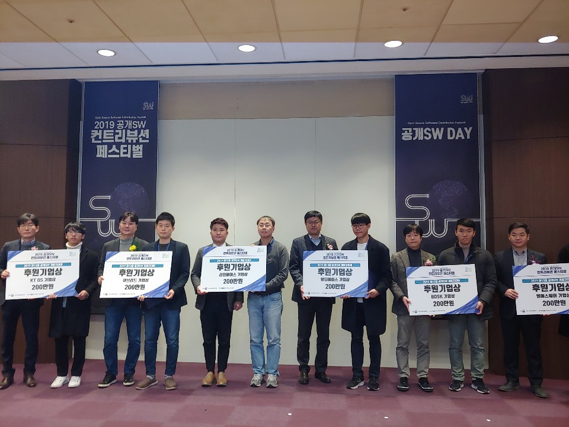
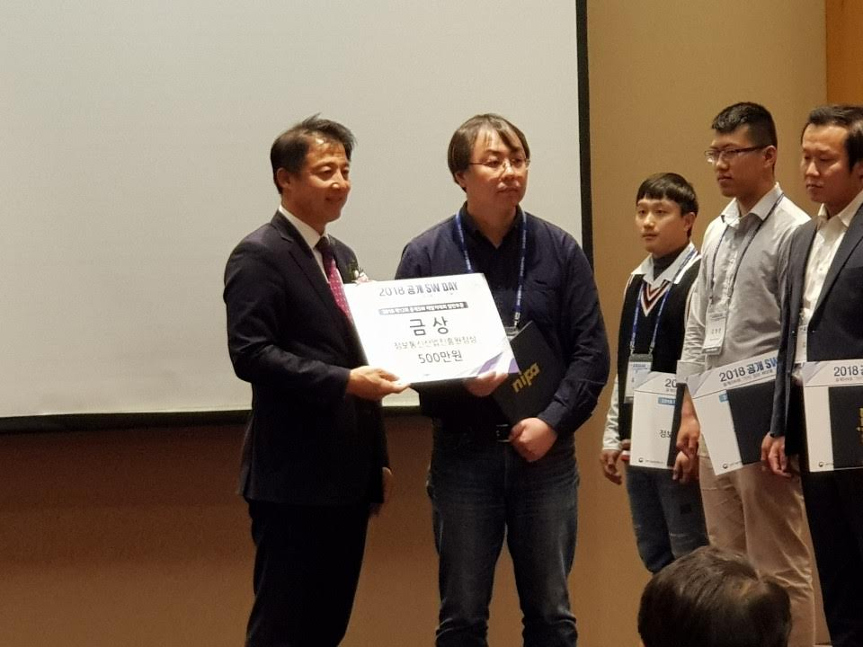

## Award

JinyDev는 다양한 프로젝트 진행과 오픈소스를 진행하고 있습니다.  
일부 결과물은 관련 대회에서 수상을 받았습니다. 프로젝트 참여는 누구에게나 열여져 있습니다.    

 

### Etri OpenAPI : 20219

Etri에서 진행한 인공지능 서비스 OpenAPI의 활용 개발자 대회가 진행 되었습니다.  

* `가작`수상
* 일자 : 20219.12.19

    

        
    

    

        
    

 

###  제13회 공개소프트 개발자대회 : 2019

2020년 과학기술부 주관 NIPA에서 제13회 공개소프트 개발자 대회가 진행되었습니다.  

오픈 API 백엔드 서버를 구축할 수 있는 `jinyAPI` 가 `동상`을 수상 받았습니다.  

* 출품작 : jinyAPI
* 일자: 20219.12.4

 

### 제12회 공개소프트 개발자대회: 2018

*  금상수상
* 출품작 : jinyPHP
* 일자: 20218.12.4

  