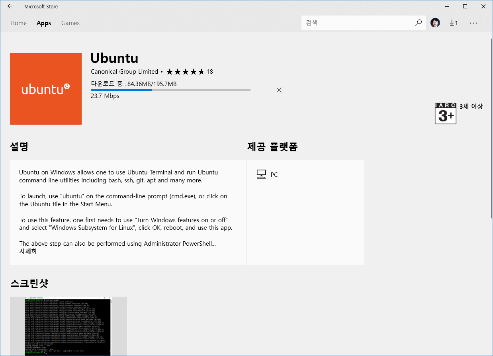
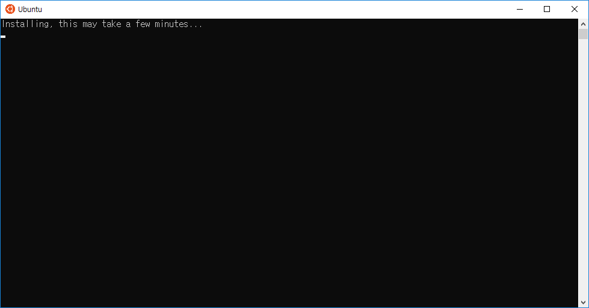
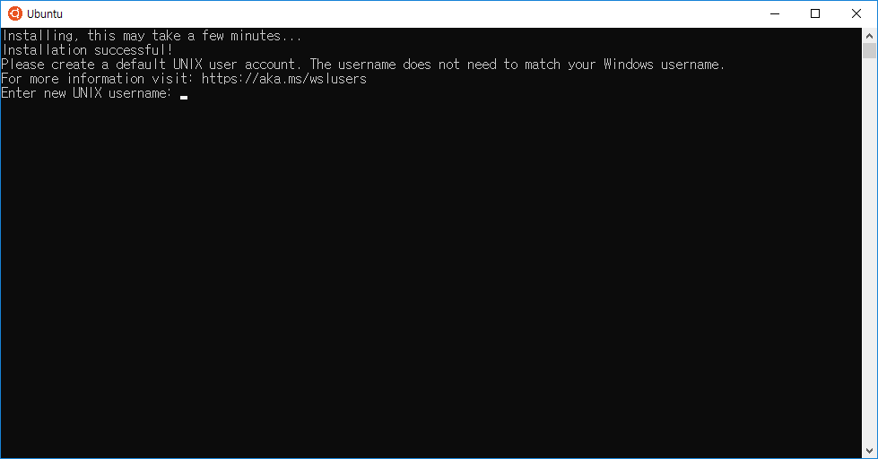

### 윈도우 우분투 설치
---

윈도우 우분투 WSL은 `윈도우 스토어`에서 무료로 쉽게 설치를 할 수 있습니다.

윈도우 스토어로 이동후 검색란에 `ubnntu`를 입력해 봅니다. ubuntu를 찾아 설치 버튼을 선택합니다. 

설치는 네트워크 속도에 따라 다르겠지만, 용량은 그리 크지 않습니다. 설치가 완료가 되면 우분투 앱이 하나 추가 되게 됩니다.

우분투 앱을 클릭하여 실행을 합니다.

앱을 처음 실행을 할때 미설정된 우분투 세팅을 시작하게 됩니다. 잠시 몇분만 기다리시면 됩니다.

우분투 암호를 설정을 합니다. 설정후에는 윈도우에서 우분투 리눅스를 사용을 할 수 있습니다.

