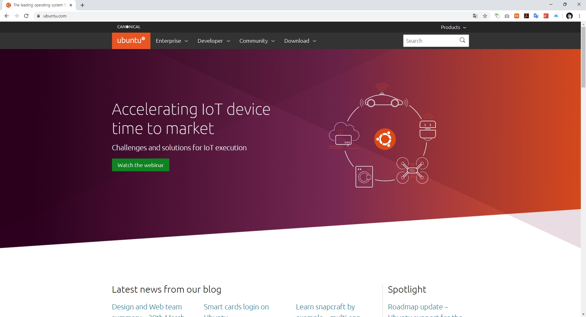

# 우분투 리눅스

우분투 리눅스는 `https://ubuntu.com`에서 무료로 다운로드 받을 수 있습니다.

## 배포본
우분투 공삭사이트에 접속하여 iso 파일을 다운로드 받습니다.  
다운로드 받은 iso 파일을 이용하여 부팅이미지를 만들어 설치를 할 수 있습니다.  

### 물리적 설치

### 가상머신 설치
윈도우 운영체제상에서 가상 머신을 이용하여 우분투 리눅스를 설치할 수 있습니다.  

가상머신의 종류
* [버츄얼박스](virtualbox)
* VMWare

